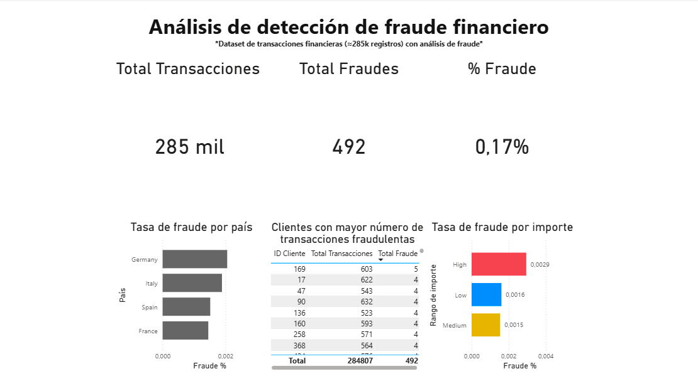

# Fraud Detection Analysis

## 📊 Dashboard Preview

## 🧱 Data Pipeline

1. Data ingestion (CSV)
2. Data transformation using Python (Pandas)
3. Data storage and modeling in PostgreSQL
4. Visualization using Power BI

## 🚀 Key Insights

- Fraud rate is extremely low (~0.17%), indicating a highly imbalanced dataset
- High-value transactions show significantly higher fraud probability
- Germany presents slightly higher fraud incidence compared to other countries
- Certain customers exhibit repeated fraudulent behavior